<link rel="stylesheet" href="./styles/index.css">
<link rel="stylesheet" href="./styles/variant.css">

<h1 class="hero-title">从 Chat 到 Agent</h1>

AI 研发实践与探索

  <SpeakerProfile compact />

2026.07.15

<!--
TODO：用 20 秒解释为什么今天值得聊这个话题
建议开场不是介绍工具，而是说一个团队正在面对的真实变化
-->

---
title: 在开始之前
---

在开始之前

  <iframe src="https://bun.com/blog/bun-in-rust" title="Rewriting Bun in Rust" loading="lazy" />

来源：<a href="https://bun.com/blog/bun-in-rust">https://bun.com/blog/bun-in-rust</a>

---
title: 今天聊什么
---

今天聊什么

  <v-clicks>
  

    

      Evolution
    

    

      
Stages

      
Status

    

  

  

    

      Practice
    

    

      
Codex

      
Code Review

      
CI/CD

      
Observability

      
Memory

      
Others

    

  

  

    

      Future
    

    

      
Next

    

  

  </v-clicks>

<DeckFooter section="Overview" />

---
title: Evolution
class: section-divider-slide
---

Evolution

---
title: Stages
---

Stages

  

    
Chat

    
Agent

    
Auto

    
▶

  

  

    <v-clicks>
    
Chat

    
Agent

    
Auto

    </v-clicks>
  

<DeckFooter section="Evolution" />

---
title: Status
---

Status

  

    

      质量
    

    

      价格
    

    

      速度
    

    <svg class="triangle__svg" viewBox="0 0 300 260">
      <polygon points="150,20 20,240 280,240" fill="none" stroke="rgba(108,168,255,0.72)" stroke-width="2.4" />
    </svg>
    
模型

    
三者不可兼得，必须做出取舍

  

  

    
构建一个好的 AI 研发体系，需要：

    <v-clicks>
    

      一流的模型：
      GPT-5.6 / Claude Fable 5 / Claude Opus 4.8
    

    

      一流的工具：
      Codex / Claude Code / CodeRabbit / Linear / Slack / Mintlify
    

    

      一流的平台：
      AWS / Cloudflare / Vercel / GitHub
    

    </v-clicks>
  

<DeckFooter section="Evolution" />

---
title: Practice
class: section-divider-slide
---

Practice

---
title: Codex
---

Codex

  
把 AI 从对话带进真实研发流程

  <ul class="practice-intro__list">
    <li>Goal</li>
    <li>Computer Use &amp; Record &amp; Replay</li>
  </ul>

<DeckFooter section="Practice" />

---
title: Codex / Goal
---

Codex / Goal

让 AI 从目标出发，完成可验证的任务

明确目标

约束边界

验收结果

<DeckFooter section="Practice" />

---
title: Codex / Goal / Screenshot
---

Codex / Goal

<h2>复杂问题持续验证</h2>

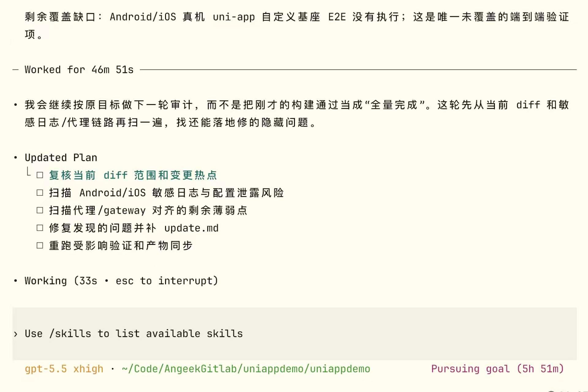

Codex Goal 执行过程

<DeckFooter section="Practice" />

---
title: Codex / Computer Use & Record & Replay
transition: fade
---

Codex / Computer Use &amp; Record &amp; Replay

<h2>UI 操作复用</h2>

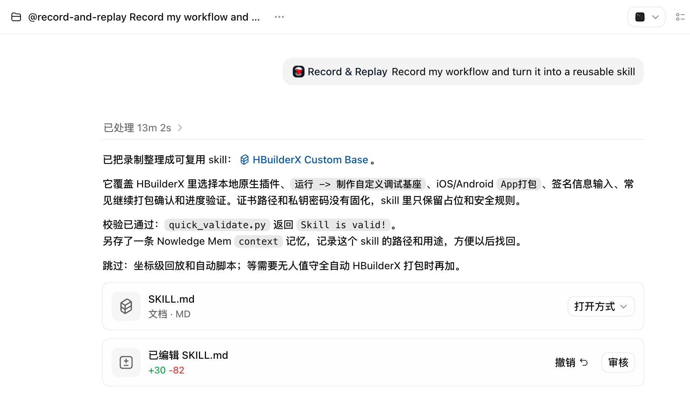

Record &amp; Replay 生成的 <strong>UniApp 打包 Skill</strong>

<DeckFooter section="Practice" />

---
title: Codex / Computer Use & Record & Replay
transition: fade
---

Codex / Computer Use &amp; Record &amp; Replay

<strong>录制</strong>

↓

<strong>AI</strong>

↓

<strong>Skills</strong>

<video src="./public/record-replay.mp4" autoplay muted playsinline></video>

Record &amp; Replay 生成的 <strong>UniApp 打包 Skill</strong>

<DeckFooter section="Practice" />

---
title: Code Review
---

Code Review

<h2>大模型检查代码</h2>

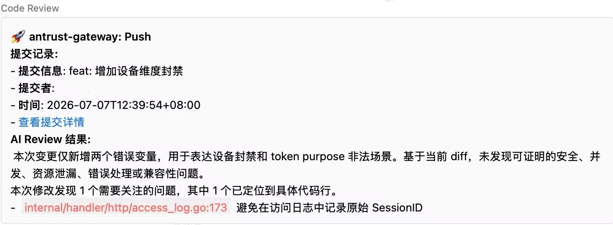

企业微信 Code Review 机器人

<DeckFooter section="Practice" />

---
title: Code Review
---

Code Review

  
<h2>行级代码审查</h2>

  

    

      

        
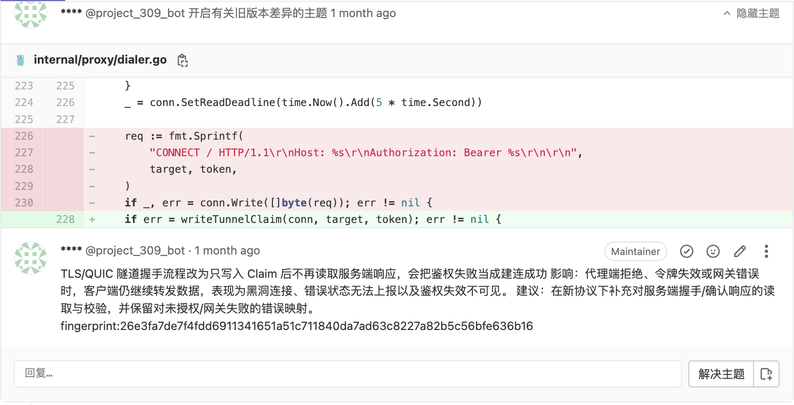

        
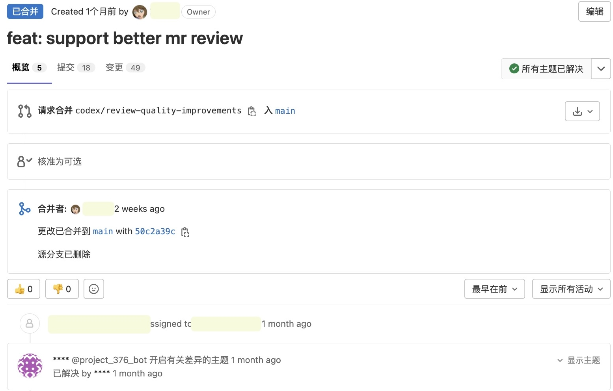

      

      
GitLab MR 代码审查

    

  

<DeckFooter section="Practice" />

---
title: CI/CD
---

CI/CD

<h2>持续化集成部署</h2>

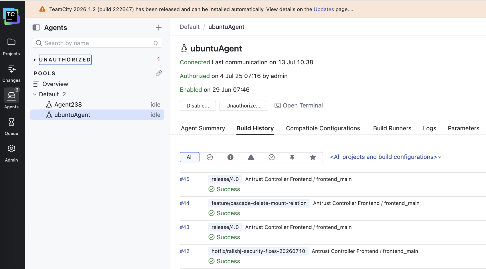

TeamCity

<DeckFooter section="Practice" />

---
title: Memory
---

Memory

<h2>记住重要的内容</h2>

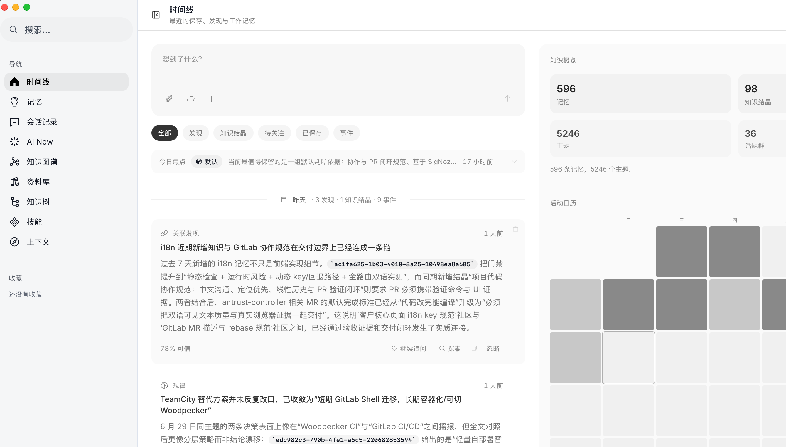

Nowledge Mem 时间线效果

<DeckFooter section="Practice" />

---
title: Observability / SigNoz
---

Observability

<h2>系统持续监测</h2>

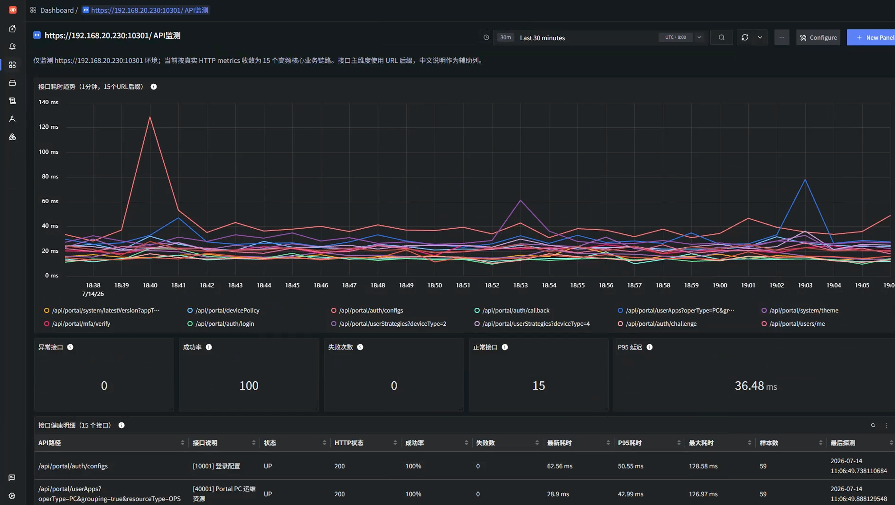

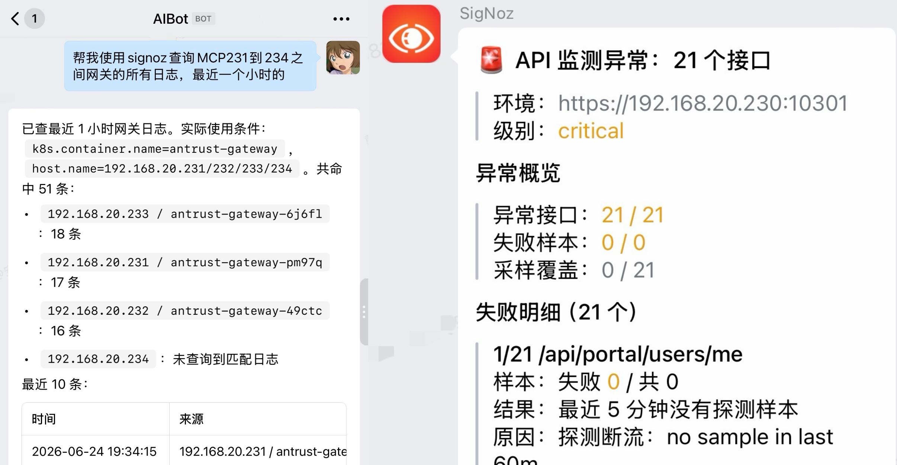

SigNoz 可观测性面板SigNoz Alert 和 MCP

<DeckFooter section="Practice" />

---
title: Others
---

Others

<v-clicks>
  

    
<h2>ONES-MCP 任务管理</h2>
快速查询任务和缺陷，并直接更新处理状态，让 AI 进入团队协作流程

    
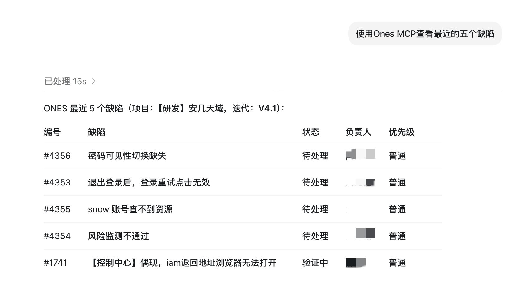

  

  

    
<h2>Document Skills 文档生成</h2>
沉淀文档结构、风格与格式，让 AI 生成的交付物更清晰、更专业

    
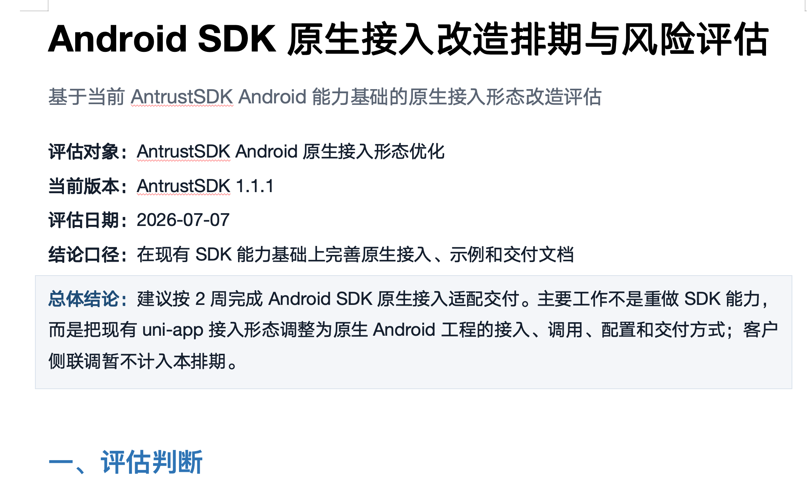

  

  

    
<h2>Multi-Agent 并行执行</h2>
多个 Agent 同时执行互不冲突的子任务，缩短复杂工作的整体交付时间

    
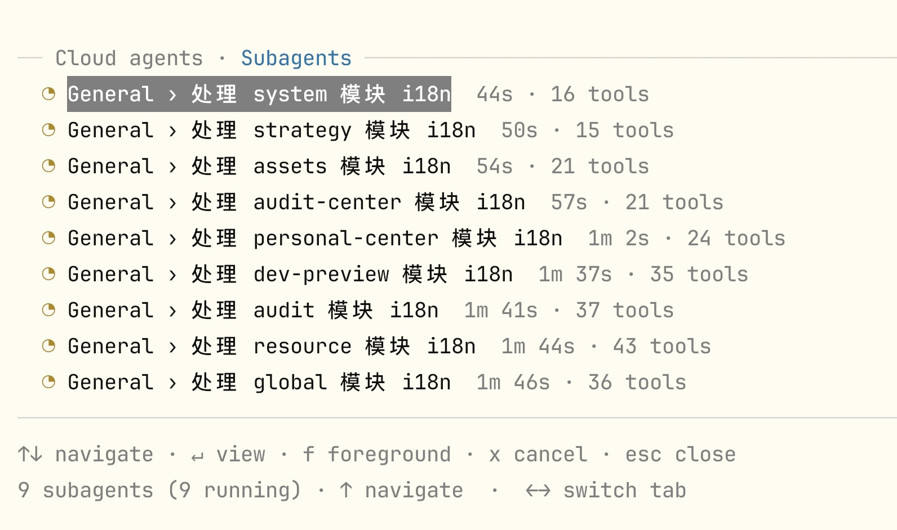

  

  </v-clicks>

<DeckFooter section="Practice" />

---
title: Output
---

Output

  

    
GitLab92 个仓库461 个分支

  

  

  

    
团队产出规模<i class="legend-before"></i>AI 使用前 <i class="legend-after"></i>AI 使用后

    

      

<label>Commit</label>

AI 使用前<i class="single-output-chart__bar single-output-chart__bar--before" style="--bar-size:28.6%"></i><b>1,476</b>

AI 使用后<i class="single-output-chart__bar single-output-chart__bar--after" style="--bar-size:100%"></i><b>5,152</b>

<strong>+249.1%</strong>

      

<label>Changed lines</label>

AI 使用前<i class="single-output-chart__bar single-output-chart__bar--before" style="--bar-size:28.6%"></i><b>1.31M</b>

AI 使用后<i class="single-output-chart__bar single-output-chart__bar--after" style="--bar-size:83.1%"></i><b>3.80M</b>

<strong>+189.9%</strong>

    

  

  
使用 AI 后，提交次数提升 249.1%，代码改动量提升 189.9%

  

<DeckFooter section="Practice" />

---
title: Future
class: section-divider-slide
---

Future

---
title: Future / Next
---

Next

  
EVALUATION<h3>建立持续评估</h3>
用真实数据持续校准 AI 研发效果

  
ASSETS<h3>沉淀团队专属能力</h3>
将 Memory、Skills 与实践沉淀为团队资产

  
COLLABORATION<h3>扩大协作边界</h3>
让 AI 串联代码、评审、交付与运维

  
SAFETY<h3>补齐安全与治理</h3>
在权限、审计与人工确认中守住边界

<DeckFooter section="Future" />

---
title: Thank You
---

  

    
Thank You

    <SpeakerProfile compact />
  

  

    
致谢

    

      <PoweredBySlidev />
    

    
Created by Codex & Devin

    
封面来源：<a href="https://unsplash.com/@yancymin" target="_blank">Yancy Min</a> / <a href="https://unsplash.com/photos/a-close-up-of-a-text-description-on-a-computer-screen-842ofHC6MaI" target="_blank">Unsplash</a>

    
设计参考：<a href="https://github.com/BaizeAI/talks" target="_blank">BaizeAI/talks</a> / <a href="https://github.com/LittleSound/talks-template" target="_blank">LittleSound/talks-template</a>

  

